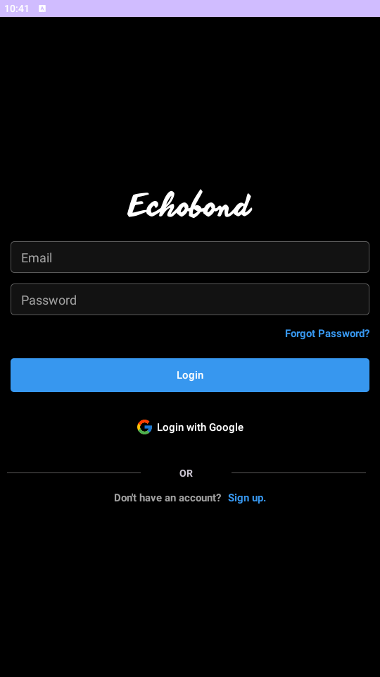
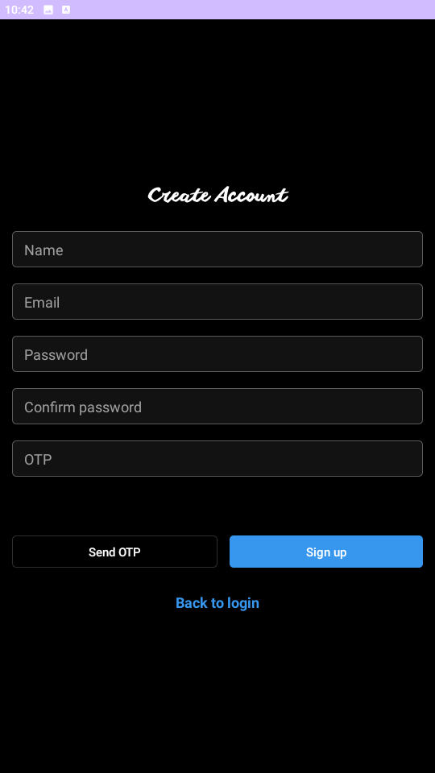

# APP SOCIAL NETWORK
## Team  Members:
```bash
Saigon University ,Faculty of Information Technology ,Major in Software Engineering
ID          | Full Name
3120410278 - Nguyễn Thanh Quỳnh Linh
3120410316 - Quan Văn Mạnh
3120410178 - Phan Văn Hoàn
3120410313 - Đặng Thị Mỹ Ly
3120410300 - Đoàn Thành Lợi
3120410289 - Trần Thị Hạ Long
```
## Project Description:
This is a social networking application built with features such as chat, chat group, follow, post, post story, log in (account, google), register, scan QR code (personal page) ,... The application is built according to Instagram's model and improved to suit the project
## Tech Stack Used:
```bash
    - Frontend:Material,XML,ML Kit 
    - Backend:Java(Spring Boot),MongoDB(Cloud),Frisebase,Pusher,Socket,Retrofit2,Glide
```
## Website Functions:
```bash
    * Log in sign up
    * Load and edit profiles
    * Post articles, edit articles (Photo, Video, caption)
    * Comment on articles, respond to comments
    * Like, share the article, drop the icon
    * Post stories
    * Follow or unfollow
    * Chat 1 vs 1
    * Group chat (Group chat)
    * Search
    * Change Password
    * Show friend suggestions
    * Scan the QR code to display the personal page
```
## [Project Demo Link]([https://www.youtube.com/watch?v=20o8wvX0VQw](https://youtu.be/2TR-u_WX7tU?si=1MO8wxxKaDUzIFDO))
## Some features of the site:
Sign In                   |                   Sign Up
:---------------------------------:        |      :------------------------------:
  | 

### Make sure to star the repository if you find it helpful!
<a href="https://github.com/Qmanh1804/AppSocialNetwork/stargazers"></a>
