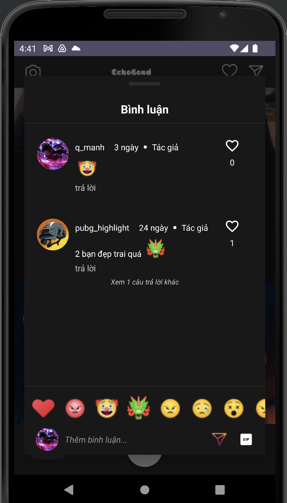

# APP SOCIAL NETWORK
The development of social networks has had a great influence on the lives of the entire society in recent years. In the era called The Built World according to the opinion of Thomas L. Friedman, author of the book The World is Flat (Biological World), no one can deny the benefits of social networks. Besides the many benefits that social networks bring to users such as quick information, a rich amount of continuously updated information, many entertainment utilities... there is also an important aspect. , drastically changing the protocol between individuals, groups, and countries communicating with each other, which is connectivity. Thus, social networks have become a popular means with many diverse features for users to connect, share, and receive information quickly and effectively.
For the above reason, the group decided to choose a social application network as the group's planning topic.


## Authors

- [Nguyễn Thanh Quỳnh Linh](https://github.com/Quynh-Linh-IT)
- [Quan Văn Mạnh](https://github.com/Qmanh1804)
- [Đoàn Thành Lợi](https://github.com/ThanhLoi-300)
- [Đặng Thị Mỹ Ly](https://github.com/Myyly)
- [Phan Văn Hoàn](https://github.com/Hoan265)
- [Trần Thị Hạ Long](https://github.com/HaLong2002)

## Project Description:
This is a social networking application built with features such as chat, chat group, follow, post, post story, log in (account, google), register, scan QR code (personal page) ,... The application is built according to Instagram's model and improved to suit the project
## Tech Stack Used:
```bash
    - Frontend:Material,XML,ML Kit 
    - Backend:Java(Spring Boot),MongoDB(Cloud),Frisebase,Pusher,Socket,Retrofit2,Glide
```
## Main features of the application:
```bash
1. Register:
    - User fills in information: username, email, password.
    - Click "sendOtp" to send OTP to email.
    - Enter the OTP code to complete account registration.
2. Login:
    - Enter your email and password to log in to the application.
    - Sign in with Google: Select a Google account to sign in.
Related functions:
    - Forgot password:
    - Enter your registered email.
    - The OTP code will be sent to your email to reset your password.
3. Post:
    - Create a post:
    - Select 1 or more photos from phone memory or take a photo from the camera.
    - Add content as desired.
    - Like the post, view and search for people who liked the post.
    - Comment and reply to posts using text or icons.
    - Drop a heart, delete comment.
4. Post stories:
    - Post a story with 1 photo from phone memory.
    - Add text and stickers that can be moved freely.
    - View stories:
    - Each story has a running time of 5 seconds.
    - Automatically move to the next story if available, otherwise return to the main screen.
    - View the list of people who have viewed your story.
5. Search:
    - Approximate search by username and post content.
    - When typing a character, the system will load users and posts with similar characters in the search bar.
6. Search in chat:
    - Approximate search by username.
    - When typing characters, the system will load users with similar characters in the search bar.
7. Follow others:
    - Can follow or unfollow other users.
8. Chat:
    - Message people you follow or create a chat group.
    - Send messages using stickers.
9. View personal page:
    - Users can view posts and liked posts.
    - See the number of people who have followed you (Following) and who follow you (Follower).
    - Unfollow or follow new users.
```
## [Project Demo Link]([https://www.youtube.com/watch?v=60rsHodIXvY])
## Application interface:

| Sign In | Sign Up | Profile | Settings Profile |
|:-------:|:-------:|:-------:|:----------------:|
|  |  |  |  |

| Following | Follower | Suggest | Edit Profile |
|:---------:|:--------:|:-------:|:------------:|
|  |  |  |  |

| Post Profile | Edit Profile | Add Stories | Stories |
|:------------:|:------------:|:-------:|:------------:|
|  |  |  |  |

| Chat | Chat Groups | Comments | Create Post |
|:------------:|:------------:|:-------:|:------------:|
|  |  |  |  |

| Notifications | Search |
|:------------:|:------------:|
|  |  | 


### Make sure to star the repository if you find it helpful!
<a href="https://github.com/Qmanh1804/AppSocialNetwork/stargazers"></a>
